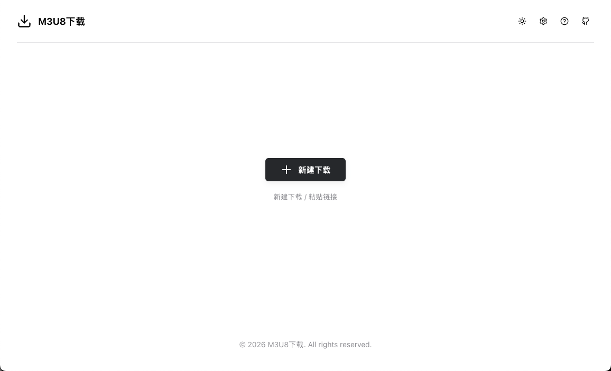
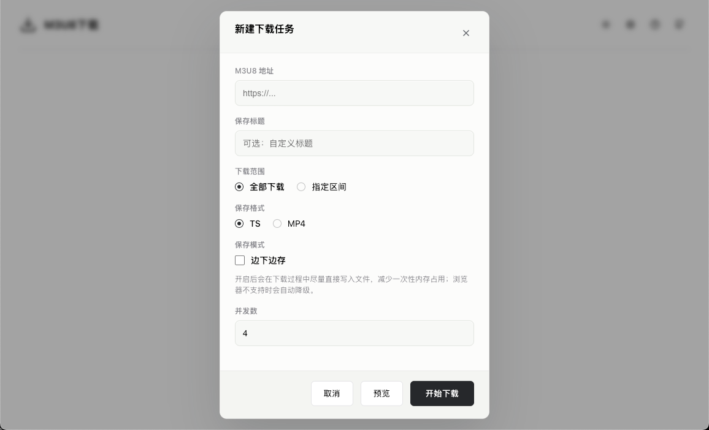
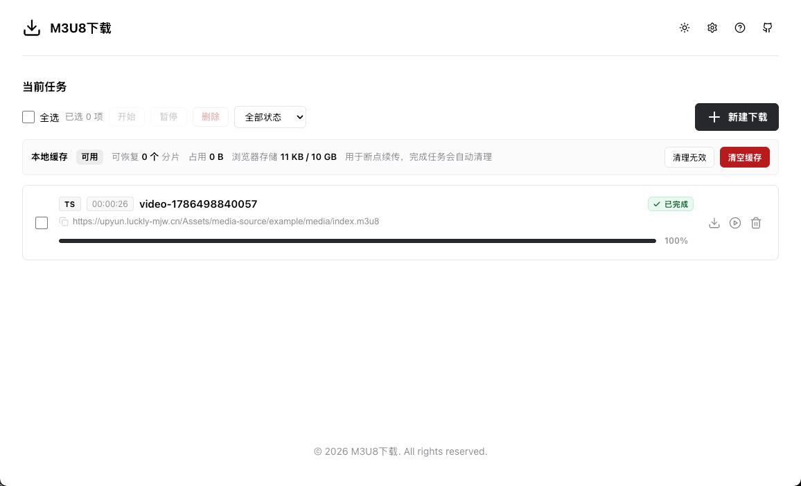
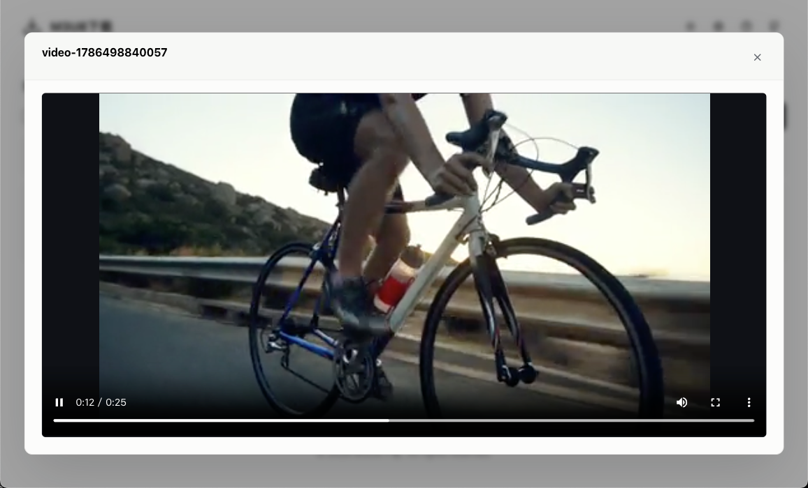
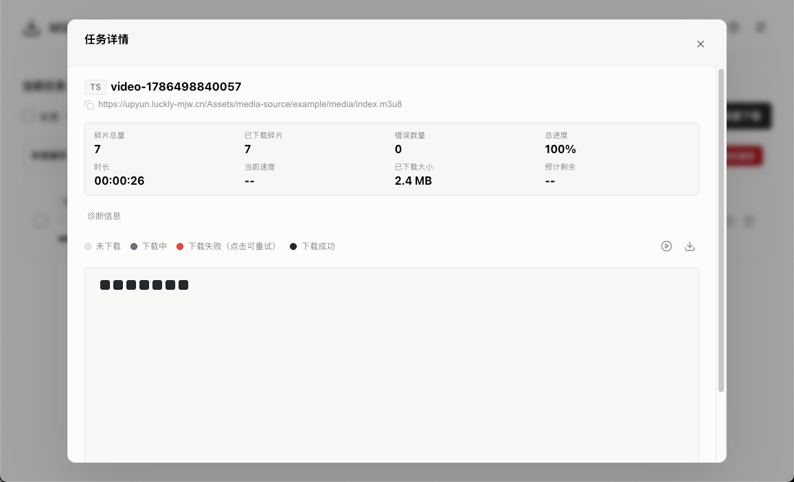

# M3U8下载

[M3U8下载](https://getm3u8.com/) 是一个运行在浏览器中的 HLS（m3u8）下载与预览工具。无需安装客户端，也不需要后端服务；解析、下载、合并和保存均在本地浏览器内完成。

## 功能

- 解析媒体播放列表与多清晰度播放列表，可选择分辨率。
- 支持在线预览播放，以及可用的外部音轨和 WebVTT 字幕选择。
- 支持 AES-128 加密分片解密。
- 支持 TS 保存与 MP4 导出；支持普通合并和已下载分片的强制合并。
- 支持全部下载或按真实分片序号指定下载范围。
- 支持 1 至 8 路分片并发下载、暂停、恢复、失败分片重试和批量操作。
- 支持 IndexedDB 分片缓存：刷新页面后可继续未完成的非流式任务，并可查看或清理缓存。
- 支持边下边存以降低内存占用；浏览器不支持时会自动降级为普通缓存下载。
- 支持通过 URL 参数预填下载任务，或直接粘贴 m3u8 地址创建任务。
- 深色与浅色主题、保存标题模板和默认下载参数均可在设置中调整。

## 预览

### 首页



### 新建下载任务



### 下载任务



### 视频预览



### 分片详情



## 部署

本项目是静态站点，可部署到 GitHub Pages、Cloudflare Pages、Netlify、Vercel 或任意静态文件服务器。

建议通过 HTTPS 访问。部分浏览器的边下边存能力依赖安全上下文；直接打开 `index.html` 可以浏览界面，但 Service Worker 相关能力通常无法使用。

## 使用

1. 点击“新建下载”，或将 m3u8 地址直接粘贴到页面。
2. 填写保存标题，选择 TS 或 MP4、下载范围、并发数与保存模式。
3. 若播放列表提供多种清晰度、外部音轨或字幕，选择所需内容后确认下载。
4. 在任务列表中查看实时进度、速度、剩余时间和分片状态；可暂停、继续、重试或删除任务。

### 快捷下载链接

可通过地址栏参数预填并创建下载任务。建议对 `source` 值进行 URL 编码：

```text
https://getm3u8.com/?source=https%3A%2F%2Fexample.com%2Fvideo.m3u8&title=demo&format=mp4
```

支持的参数：

| 参数 | 说明 |
| --- | --- |
| `source` | m3u8 地址，必填。 |
| `title` | 预填保存标题。 |
| `format` | `ts` 或 `mp4`。 |
| `streamSave` | `1` 或 `true` 时开启边下边存。 |
| `range` | `all` 或 `custom`；选择 `custom` 后再确认片段范围。 |
| `concurrency` | 分片并发数，范围为 `1` 至 `8`。 |
| `_ignore` | 从 `source` 内部移除指定查询参数，多个名称用逗号分隔。 |

例如，以下链接会从源地址中移除 `token` 和 `expires`：

```text
https://getm3u8.com/?source=https%3A%2F%2Fexample.com%2Fvideo.m3u8%3Ftoken%3Dabc%26expires%3D123&_ignore=token,expires
```

## 使用限制

- 这是纯浏览器工具，目标播放列表、密钥、分片和字幕资源必须允许浏览器跨域访问（CORS）。
- DRM 保护内容、需要平台登录或依赖特定请求头/Cookie 的资源通常无法下载。
- MP4 导出依赖浏览器内的 TS 转封装能力；遇到不兼容的编码或媒体结构时，请尝试保存为 TS。
- 下载与缓存均使用本地浏览器存储。清除站点数据、使用无痕模式或存储空间不足会影响任务恢复。
- 请仅下载你拥有访问和保存权限的内容，并遵守内容服务方的条款及适用法律。

## 贡献与反馈

欢迎通过 [Issues](https://github.com/caiweiming/get-m3u8/issues) 提交问题或建议，也可以发起 [Pull Request](https://github.com/caiweiming/get-m3u8/pulls)。

- 邮箱：support@getm3u8.com
- GitHub：https://github.com/caiweiming/get-m3u8

## 许可证

本项目的业务代码采用 [MIT License](LICENSE) 开源。

## 第三方组件与许可证

为提供浏览器兼容性，仓库随附以下第三方运行时组件；其版权及许可证归各自权利人所有，不受本项目 MIT 许可证替代。

| 组件 | 本地文件 | 版本 | 许可证 |
| --- | --- | --- | --- |
| hls.js | `vendor/hls.min.js` | 1.6.16 | Apache-2.0 |
| mux.js | `vendor/mux.min.js` | 6.3.0 | Apache-2.0 |
| StreamSaver | `vendor/streamsaver.js`、`vendor/streamsaver-mitm.html`、`vendor/sw.js` | 2.0.5 | MIT |
| Lucide | `vendor/lucide.min.js` | 0.321.0 | ISC |

相关许可声明可在对应分发文件的文件头或其上游项目中查阅。
